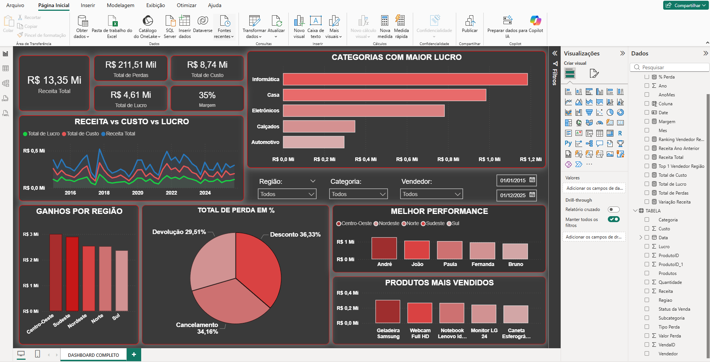

# 📊 Dashboard de Análise de Receita, Custos e Performance Comercial

## 🎯 Objetivo

Desenvolver um dashboard estratégico no Power BI para identificar oportunidades de melhoria, redução de perdas e aumento de lucratividade, com foco na análise de desempenho comercial ao longo do tempo.

---

## 📌 Problema de Negócio

Empresas frequentemente enfrentam dificuldades em:

* Identificar onde estão perdendo dinheiro
* Entender quais produtos realmente geram lucro
* Avaliar a performance de vendedores por região
* Analisar impacto de devoluções, cancelamentos e descontos

Este projeto foi desenvolvido para transformar dados brutos em insights acionáveis.

---

## 📊 Principais Métricas

* Receita Total: R$ 13,35 Mi
* Custo Total: R$ 8,74 Mi
* Lucro Total: R$ 4,61 Mi
* Margem: 35%
* Total de Perdas: R$ 211,51 Mil

---

## 📈 Análises Desenvolvidas

### 🔹 Receita vs Custo vs Lucro ao longo do tempo

* Permite identificar tendências e sazonalidade
* Detecta períodos de baixa rentabilidade

### 🔹 Categorias com maior lucro

* Destaque para Informática e Casa como principais fontes de lucro

### 🔹 Ganhos por região

* Centro-Oeste e Sudeste lideram em receita

### 🔹 Análise de perdas

* Descontos representam maior impacto (36,33%)
* Cancelamentos e devoluções também relevantes

### 🔹 Performance de vendedores

* Identificação dos melhores vendedores por região
* Base para estratégias de replicação de performance

### 🔹 Produtos mais vendidos

* Identificação de produtos com maior impacto na receita

---

## 🧠 Principais Insights

* Alto volume de descontos impacta diretamente a margem
* Algumas categorias possuem alta receita, mas menor lucratividade
* A performance de vendedores varia significativamente entre regiões
* Existe concentração de receita em poucos produtos

---

## ⚙️ Tecnologias Utilizadas

* Power BI
* DAX (Data Analysis Expressions)
* Modelagem de Dados
* Excel (base de dados)

---

## 🚀 Possíveis Melhorias

* Implementação de metas comerciais
* Análise de ticket médio por cliente
* Previsão de vendas (forecast)
* Segmentação por perfil de cliente

---

## 📌 Conclusão

O dashboard permite uma visão clara e estratégica do negócio, facilitando a tomada de decisão baseada em dados e contribuindo para aumento de eficiência operacional e lucratividade.

---
